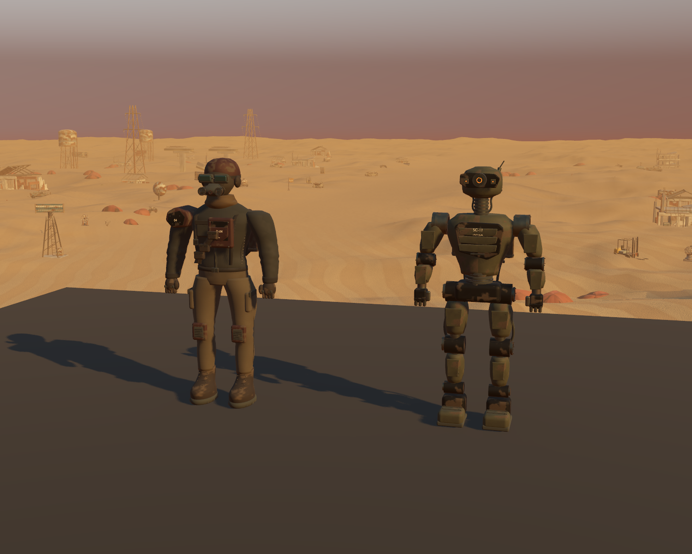

# Refined legacy enemy models

Starting state: `b5a0a51`. Continues the existing enhancement goal after the encounter-loading pass. The two older enemies looked plain beside the more recent character, machinery and ships. This pass refines their existing silhouettes and materials in Blender and integrates them into native Godot without adding story or changing enemy roles.

## Implemented tasks

1. Inspect original native front/back views and original Blender rigs. Retain the masked raider's field clothing and the scavenger's articulated utility frame. Add fitted respirator filters, goggle band, formed armor, closed pouches, connected tread blocks, woven surfaces and small markings to the raider. Add recessed optics, neck bellows, supported service plates, machined joint retainers, terminated cables and radiator fittings to the scavenger.
2. Preserve editable source assemblies and portable original material maps. Inspect Blender studio/MCP views and native close-ups; correct floating crown seams, misplaced markings, plates intersecting curved limbs, unconnected cable ends, detached tread blocks and the old blade-shaped goggle strap. Retain generated native LODs and fine vertex precision.
3. Compile only the refined geometry into the original native node graphs. Verify binding order and inverse matrices before replacing the mesh. Preserve the exact original skeleton, skin, animation tracks/keys and original fit height. Detach imported subresources, deduplicate identical texture files, and load the compiled models through the existing bounded encounter preparation.
4. Regenerate evaluated sole offsets offline and validate source hashes. Review walking, attack, death and supported boarding poses plus the normal player camera aboard the actual machine. Compare the stored original combat and ship contracts, run broader regressions and measure native rendering and first-use setup.

## Art and retained behavior

[Editable sources and rebuild instructions](../../assets/native-legacy-enemies/README.md).

| Model | Editable parts | Triangles | Skinned mesh nodes | Material surfaces |
|---|---:|---:|---:|---:|
| Dust Raider | 315 | 74,200 | 1 | 13 |
| Wasteland Scavenger | 498 | 54,944 | 1 | 9 |

Both GLBs validate without errors or warnings and contain no collapsed native triangles. They use original portable base/ORM/normal maps and small material-based optical emission, with no added realtime lights or gameplay colliders. Source files retain **813 editable parts**; the runtime batches them into two skinned meshes. The original Three.js assets remain intact.



Also retained: [raider close-up](previews/legacy-raider.png), [scavenger close-up](previews/legacy-scavenger.png), [back fittings](previews/legacy-scavenger-back.png), [boarding pose](previews/legacy-boarding.png), [normal player camera](previews/legacy-deck.png), [original raider](previews/legacy-before-raider.png), [original scavenger](previews/legacy-before-scavenger.png) and [connected Blender session](previews/legacy-blender.png). The source folder contains studio renders.

Original animation names, clip lengths, track types/paths/interpolation and every key's time/value/transition are checked exactly. All refined vertex weights target valid original joints and sum to one. The native node names, hierarchy, transforms, skeleton rest matrices, inverse bind matrices and collision dimensions remain unchanged. Added equipment bounds do not shrink the character. Idle soles sit at the support plane in all focused samples. Existing save files need no migration.

These remain the existing simpler character silhouettes; this is a material and construction refinement, not photorealistic anatomy or a new animation set. Grounding checks cover resting feet, while the native motion review checks visible fitting through representative existing poses. Broader gait quality and full-campaign human play feel remain open work.

## Verification and performance

**1,105 assertions pass across 18 suites**, including 43 focused model checks, 42 stored enemy comparisons over 1,680 ticks and 18 stored ship comparisons over 4,320 ticks. The final import, final headless suites and native review/profile runs contain no script errors or leak warnings. [Focused evidence](results/legacy-enemy-tests.json) and [suite results](results/legacy-regressions.json) retain counts and observations.

An earlier headless boarding run emitted the previously observed DummyTexture initialization warning. Final headless and native Vulkan boarding comparisons are clean; this is not an engine-fix claim. Two diagnostic fixtures were corrected during review: native float comparisons require a tolerance, and manual pose captures must finish their previous animation blend before inspecting the next pose. No expected combat results were regenerated.

The [desert checks](results/legacy-desert-tests.json) still verify sparse grounded original scenery, restrained movement, saved storms and normal water use regardless of exposed/sheltered storm conditions. Shelter advice remains removed from storm messaging; radioactive ground remains unsafe.

| View | Original GPU median | Refined GPU median | Difference | Render/shadow draws |
|---|---:|---:|---:|---:|
| Pair Idle | 4.054 ms | 4.349 ms | +0.295 ms | 173 to 188 |
| Pair Walk | 5.045 ms | 5.414 ms | +0.369 ms | 173 to 188 |
| Raider Idle | 4.367 ms | 4.702 ms | +0.335 ms | 147 to 154 |
| Raider Walk | 5.122 ms | 5.277 ms | +0.155 ms | 147 to 154 |
| Scavenger Idle | 4.637 ms | 4.956 ms | +0.319 ms | 154 to 164 |
| Scavenger Walk | 5.323 ms | 5.329 ms | +0.006 ms | 154 to 164 |

RTX 3070, 1500×1200, high Forward+/Vulkan, 4× MSAA, VSync off and a 60 FPS cap. The same frozen world, lighting and cameras render both original/refined model sets with idle or walking animations active. Each view gets two seconds of warmup and four seconds of samples. Both art sets remain resident; Blender is in Solid mode during profiling. Median frame intervals remain at the 16.666 ms cap. These fixed views measure added detail cost, not whole-game FPS or maximum throughput. Host variation applies. [Original measurements](results/legacy-original-profile.json) and [final measurements](results/legacy-refined-profile.json) retain the raw data.

The final [first-use diagnostic](results/encounter-loading-legacy-refined.json) at native 1920×1080 measures **0.467 ms** raider setup and **0.549 ms** scavenger setup after existing encounter preparation, with 8.849/8.662 ms through the next rendered frame. The title window still contains a **138.667 ms** interval. Preparation keeps these geometry loads out of enemy spawning; startup/intermittent stalls are not claimed fixed. Early Continue still has its existing synchronous fallback.


## Reproduce

```powershell
& test-results/godot-tools/Godot_v4.7.2-stable_win64_console.exe --headless --path godot --script res://tests/legacy_enemies.gd --fixed-fps 60
& test-results/godot-tools/Godot_v4.7.2-stable_win64_console.exe --path godot --script res://tests/legacy_enemy_review.gd -- --label=refined
& test-results/godot-tools/Godot_v4.7.2-stable_win64_console.exe --path godot --script res://tests/legacy_enemy_review.gd -- --poses --label=motion
& test-results/godot-tools/Godot_v4.7.2-stable_win64_console.exe --path godot --script res://tests/legacy_enemy_review.gd -- --original --profile --label=original-profile
& test-results/godot-tools/Godot_v4.7.2-stable_win64_console.exe --path godot --script res://tests/legacy_enemy_review.gd -- --profile --label=refined-profile
```

Run GPU profiles sequentially with Blender's viewport in Solid mode. Both comparisons retain both resource sets to avoid a memory-residency difference. The original review option uses the retained old footing data with the old geometry. Captures occur outside timing. All fixtures isolate saves/settings and use `test_mode`; source/studio review cameras are not added to gameplay.

The broader goal remains active. Other fixtures, fuller enemy gait review, human play feel and independently observed startup/intermittent stalls still warrant work. No new storyline or progression is added in this pass.
