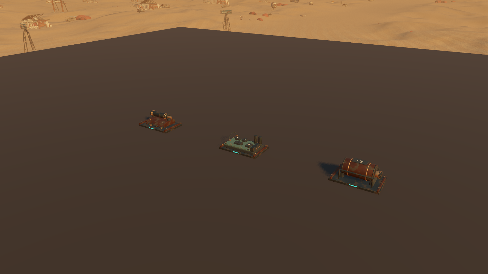
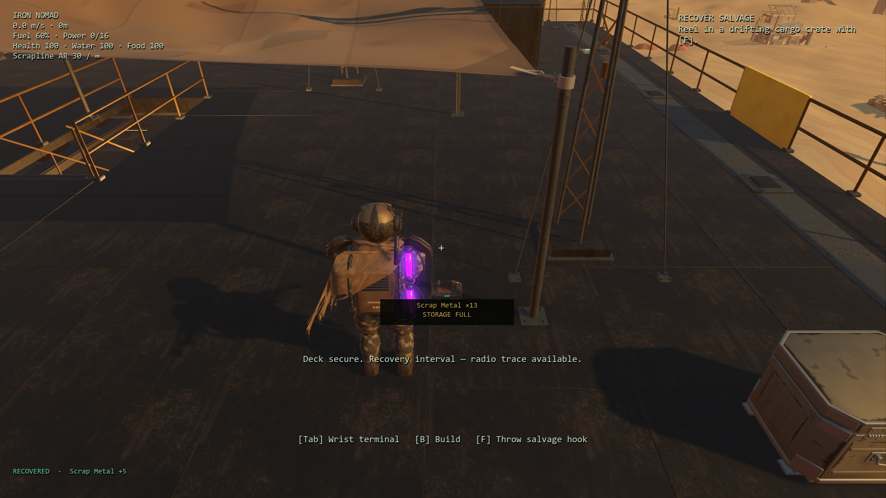

# Grounded recovered supplies and reliable pickup feedback

Starting revision: `81c6a4a`. Enemy rewards previously appeared as overlapping 16 cm cyan cubes suspended above the deck. Partial collection had no feedback, and all uncollected rewards disappeared on save/load because their records were omitted from the payload.

## Completed tasks

1. Author three original Blender assemblies: retained armor/actuator scrap, recovered electronics and a protected fuel cell. Inspect studio, live Blender MCP and native renders; correct hardware contact, lead termination and transport rails. Retain 195 editable parts and export three shared meshes with native LODs.
2. Fit models to physical deck/stair surfaces using supporting-foot corner checks. Find nearby nonoverlapping placements; allow smaller models on narrow supports. Track the support's local transform so moving/turning platforms carry both models and logical pickups. After floor removal, settle onto another real support. Unsupported offboard records remain logical rewards but do not create floating scenery on the radiation safety plane.
3. Batch all instances by resource model. Stable piles do not rebuild buffers each frame. Crowded identical supplies may share a visible pile while retaining every logical resource record and quantity. Preserve seeded reward rolls, the exclusive 1.7 m collection radius, inventory-before-shared-storage order, no expiry and no added collision.
4. Show one nearby visible pickup's contents and actual remaining quantity, with a storage-full explanation or approach cue. Place the readout below the model, on a restrained dark background. Solid walls hide it, including during rapid camera movement. Menus/cutscenes hide the readout and pause recovery receipts; build mode hides world labels. Receipts report only quantities actually transferred.
5. Include plain resource IDs, amounts and positions in manual saves and background autosaves. Validate the optional field before mutating live progress, reject malformed quantities/positions, and accept older native saves without the field. Restore after rebuilt physics supports synchronize; clear stale receipts and instance buffers.
6. Verify real imported geometry, placement, movement, collection, full-storage overflow, checkpoint round trips, malformed saves, autosave output and existing gameplay regressions. Review the actual player camera/HUD after a Warden death on the main deck. Fix the older salvage test's audio-retirement race using the existing drain helper.

## Visual review

[Editable source, dimensions and rebuild instructions](../../assets/native-loot/README.md). The 3.75 MB GLB has 42,195 triangles across three model nodes and 19 material surfaces, shared by all drops. It uses two 512-pixel PBR sets and adds no persistent lights or blocking bodies. Validator: zero errors/warnings. Native geometry: zero collapsed triangles.



The close view uses an isolated inspection pad. The following image uses the real top deck, player model, normal third-person spring arm and live HUD; a Warden generated the reward through its existing death handler. The capture waits past the existing five-second corpse boundary. Making room for five scrap transfers exactly five and leaves the other thirteen visible.



Also retained: [full storage aboard](previews/loot-deck-full.png), [27 accumulated pickups](previews/loot-accumulated.png), [focused label/receipt](previews/loot-full-storage.png), [receipt after recovery](previews/loot-recovered.png) and [live Blender MCP](previews/loot-blender.png). The focused fixture initializes the normal UI once before freezing it; otherwise the not-yet-updated damage overlay incorrectly obscures its screenshots. Fixture-only teleports/cameras do not modify the production controller.

## Verification

**1,072 assertions passed across 16 selected suites:** recovered supplies 62, equipment 137, prior-controller combat contract 42, enemy animation 113, integration 108, parity audit 132, controls/interactions 66, play parity 58, story presentation 59, crossfire handoff 66, traversal 13, audio lifecycle 50, desert/weather 28, opening handoff 32, autosave worker 31 and salvage feedback 75. The 62 focused assertions also pass with native Vulkan rendering; this rerun is not counted twice. Final native import, rendered review and selected regression logs contain no script errors or resource-leak warnings.

The focused tests cover actual imported faces/transforms/resource sharing, all three decks and stairs, support movement/removal, dense identical piles, unchanged RNG, exact collection boundaries, partial transfers, blocked sight, menu/cinematic/build visibility, receipt expiry, older saves, six malformed payloads without live-state mutation, manual checkpoints and the actual background autosave file. All fixtures use isolated save directories and `test_mode`; personal settings are not written.

The 42 combat comparisons still match the prior controller over 1,680 ticks without regenerating expectations. Desert/weather checks confirm the existing sparse natural detail and visibility-only storms, with no shelter/water penalty. No story, combat balance or reward schedule was added.

## Rendering measurements

RTX 3070, 1920×1080, high Forward+/Vulkan, 4× MSAA, VSync off. Sequential native runs use identical pad/environment/cameras, two-second warmup/four-second samples, three drops for the first two views and 27 for the last. World simulation is frozen, HUD hidden; screenshots occur after timing and Blender uses solid shading. These isolate render cost, not whole-game frame pacing or pickup CPU time.

| View | Before median GPU | After median GPU | Before median frame | After median frame | Draws before → after |
|---|---:|---:|---:|---:|---:|
| Close | 2.049 ms | 2.097 ms | 2.556 ms | 2.543 ms | 259 → 339 |
| Play distance | 1.850 ms | 1.887 ms | 2.278 ms | 2.326 ms | 114 → 194 |
| Accumulated, 27 drops | 2.380 ms | 2.549 ms | 2.815 ms | 3.007 ms | 354 → 320 |

Detailed geometry adds 0.037–0.169 ms median GPU time in these views. At 27 drops the batches remove 34 total render/shadow draws despite the richer assets. This is a bounded visual cost and better batching under accumulation, **not evidence of an overall FPS increase**. Raw results are retained under `results/loot-*`.

```powershell
& test-results/godot-tools/Godot_v4.7.2-stable_win64_console.exe --headless --path godot --script res://tests/loot_feedback.gd --fixed-fps 60
& test-results/godot-tools/Godot_v4.7.2-stable_win64_console.exe --path godot --script res://tests/loot_review.gd -- --label=after
& test-results/godot-tools/Godot_v4.7.2-stable_win64_console.exe --path godot --script res://tests/loot_deck_review.gd
```

The broader goal remains active. Legacy robot surfaces, richer boarding movement, full-campaign human play feel and previously observed startup/intermittent stalls remain separate improvement candidates.
