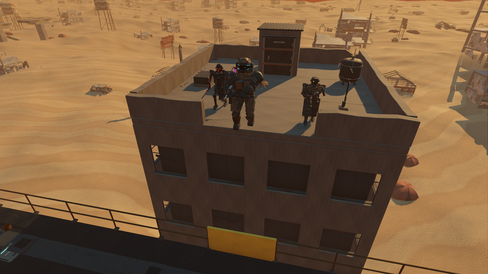
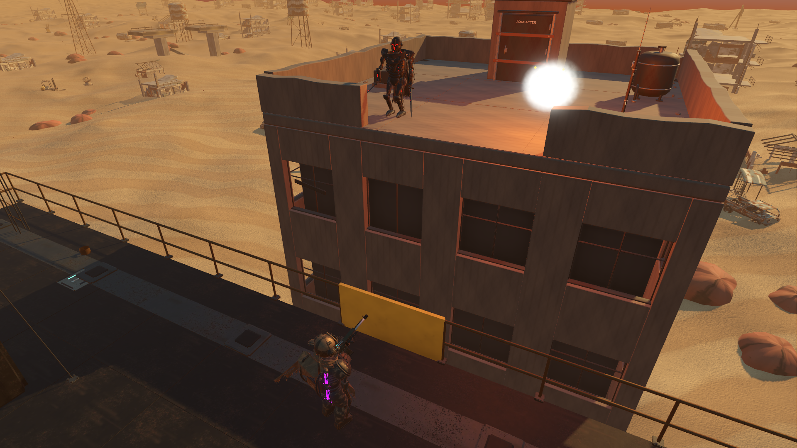

# Clear opening action and a detailed rooftop

Baseline `d2408ee` prepared the opening without a long launch hitch, but its inherited camera passed below the rooftop wall and obscured the return fire. The rooftop also had very simple fittings. This pass replaces its native presentation and building asset while preserving the original 10.2-second story sequence.

## Presentation

The camera starts ahead of S-07 and both pursuers, follows the jump across the gap, holds all three characters in view for the two shots, and pulls back to reveal the Nomad. A brief fade conceals the final cut to the actual collision-resolved player camera and preferred FOV. It avoids a camera flight through the machine's masts. The opening camera is positioned before becoming current.

S-07 turns smoothly after landing and uses the existing two-handed arm solver to aim at the elevated robots. The rifle changes targets between shots, recoils, then lowers. Tracers originate at the weapon muzzle. The override is limited to the opening and is released on finish/skip/reset. Ordinary combat, damage and attack timing remain unchanged.

The exported actor positions, run/jump timing, original shots at 3.65 and 5.0 seconds, kills at 3.73 and 5.08 seconds, and 10.2-second finish remain unchanged in `godot/data/opening.json`. No story content was added.





[Native Nomad reveal](previews/opening-polished-reveal.png)

## Blender asset

The original building footprint, roof height of 19.522 m, launch ledge and four-metre parapet gap are retained. The new building includes recessed windows, continuous piers, joined spandrels, chipped parapets, sparse exposed rebar, roof joints and drains. Its stair head has a flashed roof, hinges, latch, restraint bars and correctly oriented lettering. The pressure vessel has a rounded shell, feet, mounting bolts, relief cap, seams, gauge and a pipe ending at a roof gland. The extractor has a curb, louvres, grille and screws; the antenna has a secured footplate, clamps and a lead terminating at its junction box.

The tank moves toward the parapet to clear the first pursuer's existing route. Equipment remains outside the sampled chase corridors. The building adds no gameplay physics bodies.

The editable [Blender source](../../assets/native-rooftop/OpeningRooftop.blend) contains **877 mesh parts**. Its game export uses **six material batches**, **120,304 triangles**, and two sets of original 1024-pixel base/ORM/normal maps. The GLB is 13,260,108 bytes. The [manifest](../../assets/native-rooftop/manifest.json) records the dimensions, equipment positions and provenance. No downloaded geometry or imagery is used.

Studio, live Blender MCP and native views were inspected. Revisions corrected parapet cap topology, reversed lettering, intersecting facade/parapet faces and equipment clearance. The MCP review appends a separate scene and preserves existing Blender scenes. The original frozen rooftop remains available to Three.js and to the comparison test.

[Studio overview](../../assets/native-rooftop/rooftop-studio.png) · [Fittings detail](../../assets/native-rooftop/rooftop-fittings.png)

## Measured cost

Matched native views on an RTX 3070 at 1920×1080, high Forward+/Vulkan, 4x MSAA, VSync off and uncapped. Both assets are resident; only one is visible. Camera and animation are fixed, game/player physics are disabled, and each view has two seconds to settle followed by three seconds of measurement. Image capture occurs after sampling.

| View | Old median GPU | Refined median GPU | Old/refined draw calls |
| --- | ---: | ---: | ---: |
| Chase, 0.5 s | 3.439 ms | 3.424 ms | 301 / 292 |
| Return fire, 3.5 s | 3.789 ms | 3.775 ms | 498 / 488 |
| Nomad reveal, 8.5 s | 4.207 ms | 4.258 ms | 1207 / 1191 |

The GPU differences are small: −0.015, −0.014 and +0.051 ms. This is a detail improvement at approximately the same measured rendering cost, not a general FPS gain. Full [comparison results](results/rooftop-profile.json) include CPU/frame measurements.

The separate capture-free, real-time opening completes with **2.112 ms New Campaign CPU**, **16.665 ms median frame**, **16.993 ms p99**, **18.460 ms maximum**, and **zero frames above 25 ms**, at a 60 FPS cap after three seconds at the title. See [opening timing evidence](results/opening-polished-performance.json). This retains the preceding loading improvement; it does not establish cold-cache or lower-end-hardware performance, or resolve older intermittent stalls elsewhere in the campaign.

The visual-review test runs separately. Its screenshot/PNG time is excluded from its timeout budget so capturing the final handoff cannot prematurely terminate the test. Capture-run frame measurements are not used for performance claims.

## Validation

**474 selected assertions pass:** opening framing 22, opening handoff 32, weapon presentation 68, integration 108, parity/navigation audit 132, playable parity 58 and rendered camera clearance 54. Final selected test/profile logs contain no Godot errors or warnings. The GLB validator reports zero errors and zero warnings; informational unused-attribute/semantic-node messages remain.

The new framing test uses triangle BVHs built from the actual imported rooftop and machine. It samples the camera at 60 Hz, checks 2,631 actor sightlines at legs/torso/head heights, and verifies screen bounds throughout the chase, jump and shots. It checks the camera path and its sampled width, plus 6,188 vertical rays across the original actor corridors. None intersect unwanted geometry. This is sampled geometric coverage, not an exhaustive guarantee at arbitrary aspect ratios.

The arm checks read the final skeleton modifier output at six points through return fire. Rifle-bore error is under 0.451 degrees, with both hand/support errors below 0.003 mm. Handoff checks cover player FOV 45, 72 and 100 and verify that the final view uses the player's real camera. [Focused results](results/opening-framing-tests.json) retain the observations.

Reproduce from the repository root:

```powershell
& 'C:/Program Files/Blender Foundation/Blender 5.1/blender.exe' --background --python tools/art/native_rooftop/build.py
node tools/art/native_rooftop/validate.mjs
& test-results/godot-tools/Godot_v4.7.2-stable_win64_console.exe --headless --editor --path godot --quit
& test-results/godot-tools/Godot_v4.7.2-stable_win64_console.exe --headless --path godot --script tests/opening_framing.gd
& test-results/godot-tools/Godot_v4.7.2-stable_win64_console.exe --path godot --script tests/rooftop_profile.gd
& test-results/godot-tools/Godot_v4.7.2-stable_win64_console.exe --path godot --script tests/opening_profile.gd -- --label=polished
& test-results/godot-tools/Godot_v4.7.2-stable_win64_console.exe --path godot --script tests/opening_profile.gd -- --label=polished-review --captures
```

Run GPU measurements sequentially without background Blender renders. The broader enhancement goal remains active. Adjacent machine pressure fittings, the canopy's very flat fabric, full-campaign feel and the independent intermittent-stall investigation remain candidates for subsequent passes.
