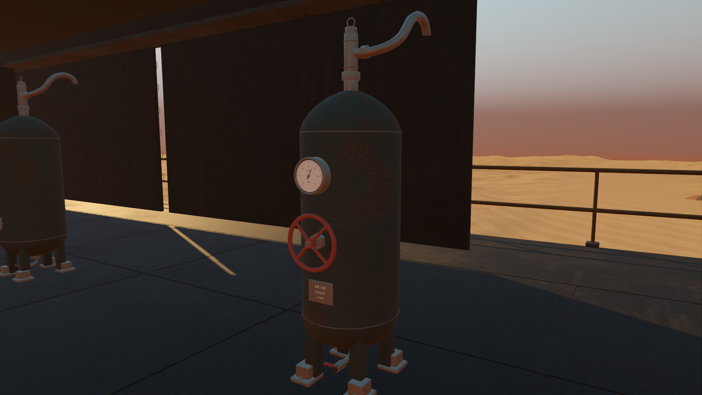
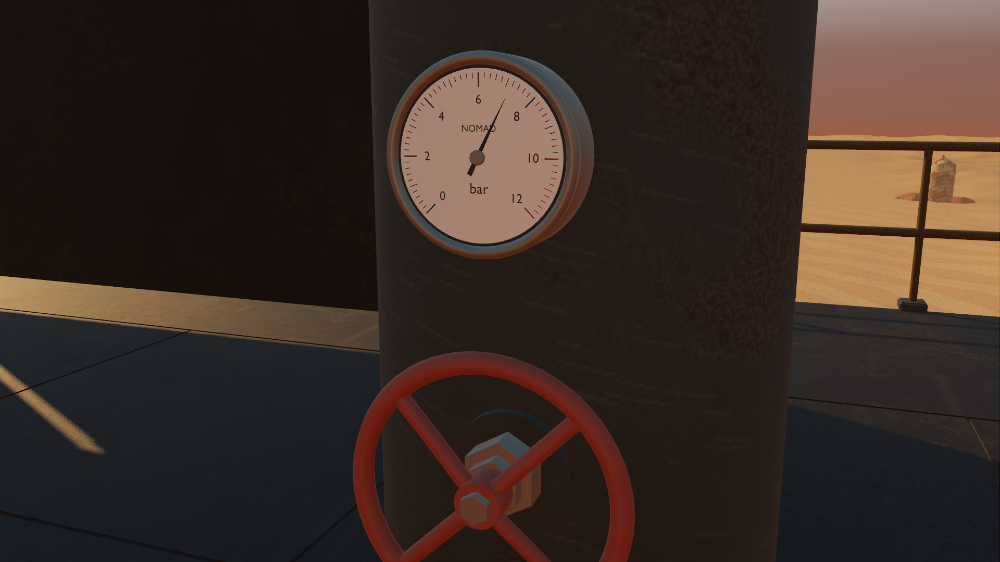

# Grounded pressure vessels and readable instruments

Starting revision: `9e84cbd` on `codex/godot-native-port`. The previous iteration refined the canopy and camera clearance. This pass replaces the five existing middle-deck pressure vessels and their fittings. No story, progression, simulation rules or interaction behavior changed.

## What changed

The original bank had visibly faceted instrument cases, needles floating in front of the faces, empty wheel rings and plain cylinder/foot assemblies. An editable Blender master now provides smooth formed heads, restrained enamel wear, actual weld seams, connected valve bodies and spokes, marked recessed gauges, secured information plates, drains and relief fittings. Every assembly retains its original site and faces the aisle.

Review caught three defects in the first art version: mirrored gauge lettering/scale order, supports that stopped below the curved tank bottom, and a foot intersecting the adjacent cargo case's restraint by roughly 23 mm. The lettering now reads correctly in Godot; all four legs extend into the formed bottom and sit on grounded foot plates; the narrower feet clear the entire exported cargo mesh. The geometric fit check reports no candidate triangle overlaps between the final receiver and nearby case, including their low hardware.

## Integration and limits

- 144 editable Blender components become one shared 27,859-triangle master with five opaque material batches. Five instances share the same mesh and material resources; no extra lights, collision bodies, particles or per-frame code are added.
- Main shell radius is 0.283 × 0.301867 m, inside the original 0.285 × 0.304 m envelope. Complete assembly height is 2.125222 m above its 12.43 m deck. Feet have exact zero local Y contact.
- Seven old shared batches are trimmed. Five retained replacements preserve all unrelated vertices exactly in Blender; actual Godot re-import differs by at most 0.501 mm. Original materials are reused. No old vessel or gauge geometry remains coincident with the replacements.
- The original concave physics shell remains active. The underside detail has a new visual silhouette, while the existing body collision and deck access remain unchanged. Gauges are cosmetic fixed readings.
- Blender MCP received a separate authored review scene; all earlier user scenes were preserved. Frozen machine/browser files were not modified.

Original modelling references are recorded in the [asset README](../../assets/native-pressure-vessels/README.md). Native before/after captures are generated by `godot/tests/vessel_review.gd`.

## Validation

All **537 selected native assertions pass**: pressure vessels 77; cargo lockers 56; machine access 13; traversal 13; integration 108; parity audit 132; play parity 58; canopy 26; rendered camera clearance 54. The final foot adjustment reran the pressure and cargo suites plus full exported mesh clearance; it did not alter collision or game code.

The receiver suite checks preservation of actual retained vertices/materials, old-geometry removal, portable textures, triangle validity, native front-facing gauge printing, shared resources, deck contact and real player movement into each of the five original collision shells. Gait updates leave every fitting fixed to the deck. The source fit test checks each support against the real dished shell, each foot against the deck, and complete receiver/case triangle overlap.

Both GLBs pass Khronos validation with zero errors and zero warnings. Informational items concern unused UV/tangent attributes on flat materials and empty named anchors. Native test and render logs have no errors or warnings. These checks cover this change; they do not establish that every remaining campaign or performance issue is solved.

## Rendering cost

The recorded [matched GPU comparison](results/vessels-profile.json) uses an RTX 3070 at 1920 × 1080, high Forward+/Vulkan, 4× MSAA, VSync off and an uncapped loop. Both old and new assets are resident in each run. Only the vessel presentation changes; gameplay is frozen. Each view warms up for two seconds and samples four seconds, with screenshot readbacks after timing. Runs are sequential with no concurrent Blender rendering.

| View | Original GPU | Refined GPU | Difference | Draw calls |
|---|---:|---:|---:|---:|
| Receiver overview | 2.307 ms | 2.374 ms | +0.067 ms | 165 → 180 |
| Dial close-up | 1.967 ms | 2.061 ms | +0.094 ms | 130 → 136 |
| Bank along aisle | 2.326 ms | 2.358 ms | +0.032 ms | 329 → 360 |
| Adjacent cargo case | 2.046 ms | 2.091 ms | +0.045 ms | 153 → 157 |

Median GPU cost rises by 0.032–0.094 ms across these views. Exact sample counts and frame-time distributions are recorded in the JSON report. This is the cost of added visible detail in fixed views, not a claim of improved FPS or a substitute for travel/combat profiling. The broader ongoing goal still includes independently observed frame stalls and refinement of other existing machine equipment.
