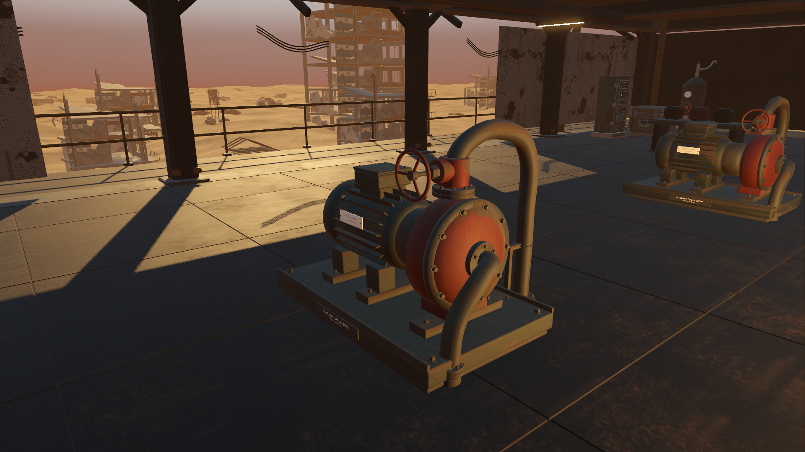
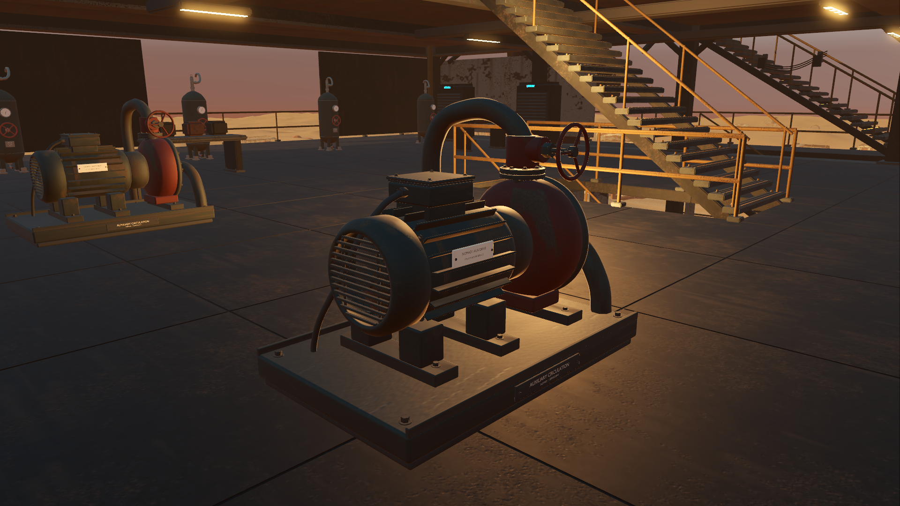

# Grounded service pumps and matching collision

Starting revision: `bad213b`, branch `codex/godot-native-port`. The preceding pass refined the electrical cabinets. Native review exposed two adjacent pumps with simple cylindrical motors, loosely mounted handwheels, unfinished discharge pipes and loose service hoses.

## Model refinement

The original Blender master has a smooth finned motor, open fan guard, terminal housing, covered coupling, cast pump body, gasketed flanges, bolted supports, readable legends and complete pipe/electrical routes into deck fittings. It is reused at both existing sites. All geometry remains within the original complete assembly bounds and below the former pipe height.

Studio inspection found cooling fins rotated across the motor; they were corrected to run along its shaft. Feet were aligned to their support rails. Native lighting then exposed overly polished fittings; their finish was changed to rough, oxidized PBR metal. The final source has 257 editable parts, five runtime material batches, three original PBR materials and 77,981 full-resolution triangles. Native import retains LODs/compression and has no collapsed triangles. All three exported GLBs validate with zero errors or warnings.

Only complete components are removed from nine shared original batches. Unrelated workshop and undercarriage coordinates remain within 1 mm after native import, with the exact original material resources. The preceding vessel/cabinet remainders and the access pass's moved side cable are preserved. Earlier geometry regression tests now account for this subsequent removal, retaining their accuracy threshold.

## Collision correction

The first physical review reproduced obsolete hose collision approximately 1.03 m ahead of a pump's centre, outside the new visible skid. It also showed the player stepping onto low equipment. The replacement now contacts the visible front edge at 0.59 m and leaves the cleared hose area unobstructed.

The authoring tool measures all 4,000 obsolete pump triangles inside the frozen shared collision mesh and verifies that none of their faces are partially selected. It exports three retained index ranges. The existing collider importer copies precisely those ranges using its existing winding conversion; all other callers retain a single complete range.

Two instances share one 1,199-triangle coarse pump shape: skid, main bodies, supports, terminal, valve, wheel and curved piping. This removes a net 1,602 physics triangles while matching the new silhouette. Cosmetic bolts, letters and individual cooling fins do not become detailed collision. The real player can step onto the low skid and is stopped by the motor. No progression, damage, timing, interaction or resource rules change.

## Verification

All **656 selected assertions pass**: pumps 45, pressure vessels 77, switchgear 74, cargo cases 56, machine access 13, traversal 13, integration 108, audit parity 132, play parity 58, canopy 26 and camera clearance 54. The [suite report](results/pumps-regressions.json) and [pump results](results/pumps-tests.json) retain the counts and actual geometry/physics measurements. Selected native test/render logs have no errors or warnings. Final pump checks and GPU captures were repeated after the material adjustment; other geometry/gameplay did not change after its passing regression runs.

The pump suite compares **every retained frozen collision triangle**, not a small set of rays, and verifies unchanged coordinates/winding with precisely 4,000 removals. It also exercises actual player movement, the former invisible-hose area, visible skid contact, shared collision resources, native model bounds, all nine retained render batches, material sharing, deck anchors, triangle validity and rigid attachment during gait.

Blender checks support contact, all 17 longitudinal fin orientations and connected-fitting bounds. Full exported triangles of each pump have zero overlapping pairs with neighbouring frozen machine surfaces after omitting the old pumps and expected deck-contact faces. Those checks complement the inspected studio, MCP and native captures; the support/termination bounds are not presented as a pressure-system engineering verification.

## Rendering cost

The [comparison report](results/pumps-profile.json) uses four matching 1920 × 1080 native views on an RTX 3070, high Forward+/Vulkan, 4× MSAA, VSync off, with two seconds of warmup and four seconds of samples per view. Both old and refined resources remain resident in both runs; the legacy view preserves all preceding cabinet, vessel and cable refinements. Runs are sequential with no concurrent Blender rendering or other Godot test processes. Screenshots are taken after measurement.

| View | Before GPU median | After GPU median | Difference | Draws, before → after |
|---|---:|---:|---:|---:|
| Front casing and valve | 2.787 ms | 2.937 ms | +0.150 ms | 392 → 407 |
| Motor and fan guard | 2.852 ms | 3.035 ms | +0.183 ms | 615 → 628 |
| Aft assembly | 3.057 ms | 3.167 ms | +0.110 ms | 425 → 437 |
| Workshop overview | 2.976 ms | 3.019 ms | +0.043 ms | 588 → 603 |

This measures the cost of added visible detail in fixed views with physics frozen. Fewer collision triangles are a complexity reduction, not a measured gameplay FPS improvement. The broad goal remains active, including simple nearby workbenches, overall campaign feel and earlier intermittent rendering stalls that have not been reproduced reliably.
