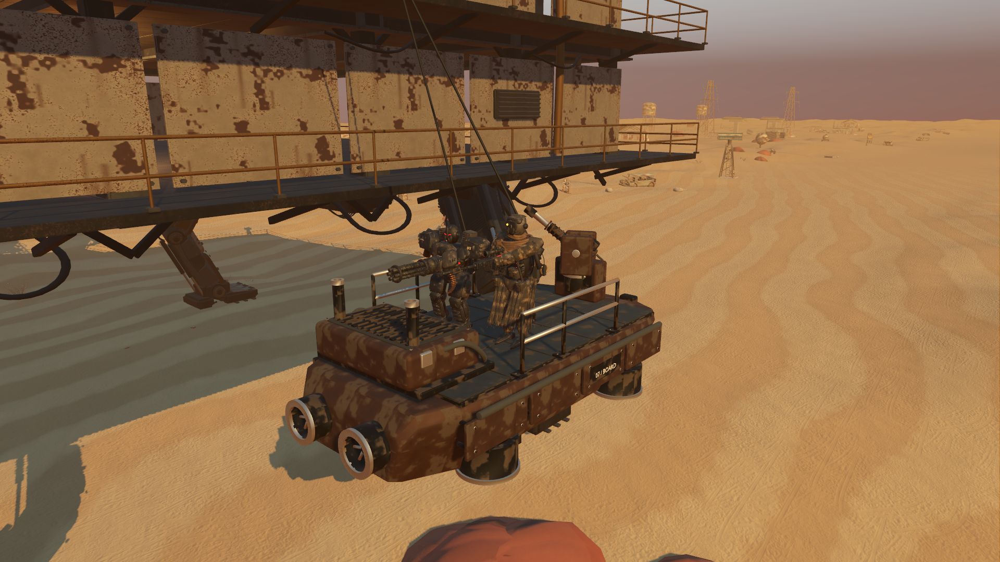

# Refined raider hover craft and supported enemy feet

Starting revision: `4da5a52`. Improve the existing skiff/gunboat, their visible weapon feedback and grounded crew. Keep combat, boarding schedules, rewards and the existing story. The preceding desert pass remains present: sparse grounded Blender details, subtle wind and visibility-only storms with no shelter-dependent water penalty.

## Implemented tasks

1. Inspect both original craft from native front/rear/deck/underside cameras. Replace wheeled hovering skiff hardware and plain hulls with original Blender models: tapered armor, recessed lift units, closed impellers, smooth bores, fitted panels, caged lamps, open exhausts and supported service equipment.
2. Preserve skiff crew/pilot markers and both guns' semantic pivots/muzzles. Join runtime meshes by articulated parent while retaining 798 editable source parts. Reuse original PBR materials, imported LODs and the existing combat collision; add no realtime lights.
3. Aim each gun toward the player and recoil on the existing volley event. Start the gunboat's warning tracer at its real moving muzzle. Dim independently copied gun/engine lenses on disable/retreat. Preserve shared source materials, shell counts, impact timing and damage.
4. Inspect actual crew on the new deck. The old character fit used equipment/rest-pose bounds: Bastion soles were 0.411 m and Warden soles 0.167 m above their origins. Bake evaluated idle sole heights for all six original rigs and change only their visual vertical offset. Preserve scale, collision, health, navigation and controller timing. Store source hashes, regenerate through native setup and avoid runtime vertex scans.
5. Correct blocked exhaust openings and gaps under gun brackets. Remove microscopic collapsed bevel faces after transforms; reconstruct four invalid Blender tangents from valid adjacent UV triangles. Reinspect source, live Blender MCP and native views, run contract/regression checks, then measure matched GPU views.

## Models and review

[Editable source and rebuild commands](../../assets/native-raiders/README.md). Skiff: **45,728 triangles, three mesh nodes, 16 surfaces**. Gunboat: **49,519 triangles, four mesh nodes, 17 surfaces**. Shared GLB: **8,828,040 bytes**, with no validator errors/warnings or collapsed imported triangles. The original browser assets are unchanged.



Also retained: [native gunboat](previews/raider-gunboat.png), [skiff underside](previews/raider-skiff-below.png), [normal player-camera boarding](previews/raider-player.png), [original skiff](previews/raider-before.png) and [Blender MCP](previews/raider-blender.png). The source folder includes a studio render.

Lift fans are static recessed geometry; no flight simulation is added. Original fixed hull/subsystem combat targets remain. The visible barrel traverses while its armored turret base stays within the original weapon target. Foot fitting corrects resting contact, not every frame of every enemy gait. Original height scaling is retained, so the heavy mech remains broad and relatively short. Existing native saves need no migration.

## Verification

**1,246 assertions pass across 19 suites:** 87 focused craft/footing checks plus 1,159 broader regression assertions. Final import, selected tests and native review logs contain no script errors or resource-leak warnings. Initial geometry/export defects were reproduced and corrected. Two test fixtures needed correction: falloff is measured in metres, and imported float values require approximate comparisons.

The focused suite checks real imported geometry, material batching, exact origins, actual deck support, heavy capsule clearance, open exhaust depth and bracket support. It sends rays into real hull/weapon/engine targets and verifies original size, armor and damage. It checks both aiming directions, recoil/muzzle origins, material isolation and disable feedback. Across six rigs and multiple idle samples, boot soles stay within 0.7 mm of the character support plane. The footing manifest must match each source model's hash.

The unchanged ship contract passes 18 comparisons over 4,320 ticks; the earlier enemy contract passes 42 comparisons over 1,680 ticks. Broader suites cover boarding, equipment, animation, integration, parity, controls, story handoffs, traversal, audio, saves, salvage and loot. Desert/weather tests still verify normal water use in clear, exposed-storm and sheltered-storm conditions, saved-weather restoration and restrained scenery. Results are retained under `results/raider-*`.

All fixtures use isolated saves and `test_mode`. Native review uses the actual game world, assets and rendering; inspection cameras are test-only. First-use asset loading still stalls: the footing fixture observed approximately 200 ms on an uncached commander spawn. Offline footing avoids adding skin-vertex scans to that path but does not fix loading. Cached repeats were roughly 1–2 ms in this diagnostic; these are not controlled before/after performance comparisons.

## Rendered cost

| View | Before GPU median | After GPU median | Difference | Render/shadow draws |
|---|---:|---:|---:|---:|
| Skiff Front | 3.190 ms | 3.231 ms | +0.041 ms | 474 to 448 |
| Skiff Rear | 2.888 ms | 2.854 ms | -0.034 ms | 216 to 194 |
| Gunboat Front | 3.274 ms | 3.298 ms | +0.024 ms | 617 to 641 |
| Gunboat Rear | 2.879 ms | 2.939 ms | +0.060 ms | 173 to 187 |

RTX 3070, 1920×1080, high Forward+/Vulkan, 4× MSAA, VSync off. Same frozen native world/cameras/lighting; two-second warmup and four-second sample per view. Models rest to isolate hull cost. Captures follow timing; Blender's viewport is solid during measurements. This measures added detail cost, not overall gameplay FPS or a fix for intermittent stalls. Normal host variation applies.

## Reproduce

```powershell
& test-results/godot-tools/Godot_v4.7.2-stable_win64_console.exe --headless --path godot --script res://tools/bake_enemy_footing.gd --fixed-fps 60
& test-results/godot-tools/Godot_v4.7.2-stable_win64_console.exe --headless --path godot --script res://tests/raider_craft.gd --fixed-fps 60
& test-results/godot-tools/Godot_v4.7.2-stable_win64_console.exe --path godot --script res://tests/raider_craft_review.gd -- --raid --label=raid
& test-results/godot-tools/Godot_v4.7.2-stable_win64_console.exe --path godot --script res://tests/raider_craft_review.gd -- --original --profile --label=profile-before
& test-results/godot-tools/Godot_v4.7.2-stable_win64_console.exe --path godot --script res://tests/raider_craft_review.gd -- --profile --label=profile-after
```

The broader enhancement goal remains active. Legacy robot/gate surfaces, fuller enemy gait review, full-campaign human play feel and existing first-load/intermittent stalls remain useful targets. No new story or progression is introduced here.
