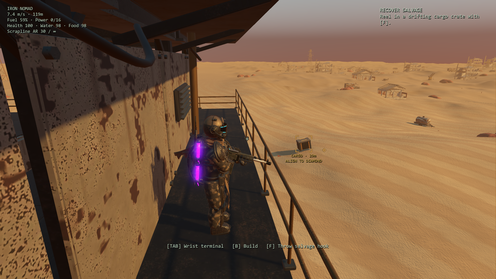

# Grounded cargo and clearer salvage feedback

Continues the [enhancement goal](enhancement-goal.md) from `26d46e4`, following the [restrained desert pass](desert-life-review.md). The normal opening and first pickup exposed three issues: cargo floated independently of the dunes, the broad aiming cone advertised throws that physically missed, and a generic receipt immediately replaced the first receiver-recovery message.

## Implemented tasks

1. Reproduce the existing opening and first natural cargo spawn using native rendering and physical F input. Retain baseline views and receipts. The diagnostic relocates the player to the lower fishing deck; it is not a complete human campaign playthrough.
2. Fit the original detailed Blender chest to its full terrain footprint, with slow drift and a small clearance. Shift unclaimed cargo with lateral travel while keeping retrieved/parked cargo aboard. Cache fitted planes within 20 cm and reset the cache on spawn/load. Use no gameplay random numbers for presentation.
3. Predict the straight hook's physical intercept using cargo velocity and the existing catch radius. Add one subdued bracket, distance and lead diamond near the current aim. Identify out-of-range cargo without promising a catch. Preserve the original 34 m reach, 42 m/s flight, 2.4 m catch radius, six-crate pool, loot and spawn cadence.
4. Preserve the existing receiver objective message and report quantities actually transferred. Keep overflow contents in a supported crate aboard, at the mesh's bottom height. Reclaiming overflow must not reroll its reward, and the existing save format must retain its contents.
5. Check the real fishing-deck view, not only isolated targeting. Open railing collision proxies remain solid for movement but allow the marker's sight check through their bars. Opaque structures still hide it. Exclude the flat radiation safety plane because it can sit above the rendered dune troughs.
6. Verify moving targets, steering, frame rates, overflow and saves; profile the terrain fit; replay the first pickup and run the existing native gameplay/story regressions.



The quiet amber bracket identifies nearby cargo and indicates where to aim. It becomes cyan when the predicted physical throw is ready. This query does not steer the hook or consume resources. During retrieval it follows the cargo. Menus, building, mounted guns, cinematics and death hide the readout. Solid-wall occlusion remains, with at most six ray hits per sight sample. The existing player model can still obscure a crate from some shoulder views.

The first pickup now retains the receiver-repair instruction alongside its item receipt. [Pickup view](previews/salvage-receipt.png), [ready view](previews/salvage-ready.png) and [original off-axis prompt](previews/salvage-before.png) show the native result. No new model, story chapter, reward or combat rule was added in this pass.

## Verification

- **75 focused checks** include 36,000 bottom-corner samples across cached fits and discontinuous travel. Clearance ranged from **0.019 to 0.215 m** in these samples. The rigid crate stays just above the changing dune surface; this is a fitted footprint, not physical settling or sand deformation.
- All 27 angle/speed/course combinations agreed between the predicted cue and actual flight (8 hits, 19 misses). Following the lead diamond caught cargo while steering at −28°, 0° and +28°. Physical sweeps also passed at 30 and 120 Hz. Future abrupt player steering or terrain curvature can still change a moving target after a cue is calculated.
- Partial storage transfers retain exact remainders, receipts list only received items, parked crates rest on real support, reclaim does not reroll, and save/restore preserves overflow.
- Open rails allow the marker, an opaque wall behind a rail hides it, the radiation safety plane does not hide visible trough cargo, and the terminal suppresses guidance.
- Existing integration (108), navigation/parity audit (132), story polish (58), and GPU physical-input parity (57) pass: **430 assertions total**. Import and final suite logs have no engine errors, script errors or warnings.

The physical-input parity fixture originally placed a crate at the old arbitrary Y=2 and aimed before its first grounding tick. It now follows the production spawn contract by fitting the crate before aiming; its catch assertion and timing remain unchanged. The rail-visibility fixture tags its physics body, matching production metadata.

The final native real-time diagnostic completed the opening in 10.804 seconds and saw the first cargo at 23.337 seconds wall time. The off-axis throw missed without advertising readiness; the aligned view showed `READY`, recovered 58 scrap and 8 fuel, and retained `awaiting-module` scanner progression. Timing varies with rendering and capture overhead; no cinematic speed change is claimed. [Before](results/salvage-before.json), [final](results/salvage-final.json), [focused](results/salvage-tests.json), and [suite summary](results/salvage-validation.json) retain the evidence.

## Cost and limits

The fixed-height baseline was cheap but visibly wrong: the 600-distance center-bottom observation found up to **3.91 m** of hover and some burial. The final observation ranged from **0.062 to 0.154 m**; the separate corner checks above cover the actual oriented footprint.

An isolated headless CPU run uses six active free crates and 2,199 post-warmup samples on the development PC. Spatial caching reduces the fitted update's mean from **0.670 to 0.325 ms**; its cached median is **0.077 ms**, p95 **0.641 ms**, and maximum **1.010 ms**. The intercept query costs **0.010 ms median**. [Cached](results/salvage-profile-final.json) and [uncached](results/salvage-profile-uncached.json) reports preserve the full measurements.

Ground fitting adds CPU work compared with the former fixed-height update. These isolated timings exclude UI drawing and do not measure rendered gameplay FPS. This pass does not claim to fix the separate intermittent engine/render stalls. The marker uses native vector drawing with no new 3D models, lights or textures. The preserved browser game is unchanged.

Reproduce from PowerShell:

```powershell
powershell -NoProfile -ExecutionPolicy Bypass -File tools/godot/launch.ps1 -SalvageTest -Headless
powershell -NoProfile -ExecutionPolicy Bypass -File tools/godot/launch.ps1 -SalvageReview
powershell -NoProfile -ExecutionPolicy Bypass -File tools/godot/launch.ps1 -SalvageProfile -Headless
```

Each uses isolated native test saves and does not write personal settings. Reports and raw screenshots go under `test-results/godot-native/`. The wider goal remains active: full-campaign play feel, some hard-coded control hints and intermittent rendering stalls still need separate review.
