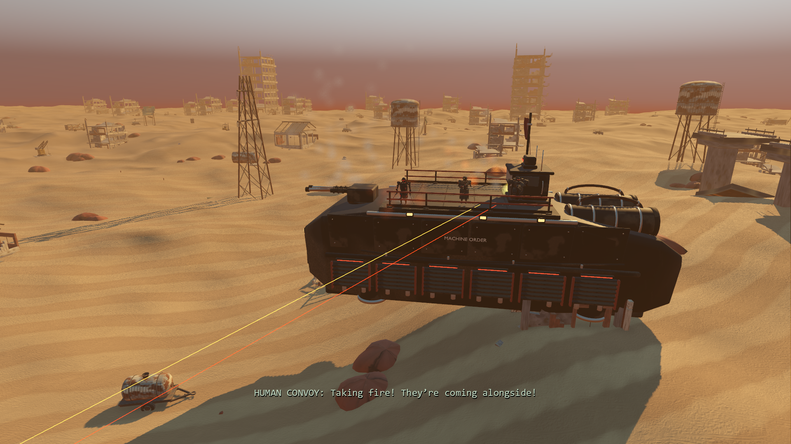

# Existing crossfire ship refinement

Starting state: `7a6711a`. Continues the [enhancement goal](enhancement-goal.md) with two detailed Blender vessels for the existing scanner battle. The preceding iteration fixed its entry hitch and camera handoff; this iteration addresses the plain hulls visible alongside the authored characters and Nomad.

## Implemented tasks

1. Inspect the existing exported hulls, native wide/close views and five crew positions. Preserve the 8.08 m staging surface, opposing-ship transforms, faction flags and existing fire origin.
2. Author tapered plated hulls, recessed vents, supported guardrails, captive fasteners, bridge glazing/hardware, rounded engines with open exhausts, service lines and hollow gun barrels. Give the human ship a worn service-vessel finish and the robot ship dark armor and restrained sensor hardware.
3. Inspect a Blender studio render, correct coplanar deck plates and armor fit, then verify the revised source through the connected Blender MCP. Preserve all pre-existing interactive scenes. Retain separate editable source parts and batch only the runtime exports by material.
4. Import portable PBR textures, normalized flag/anchor names and tangents into Godot. Measure the original/refined ships in matching rendered scenes before integrating the new assets into background preparation.
5. Verify actual triangle support and crew-body clearance, complete scanner playback, saved crossfire and skip behavior, original timing and gameplay regressions. Keep measurements and remaining issues explicit.


[Source kit, manifest and rebuilding instructions](../../assets/native-ships/README.md). The source has 555 human / 549 robot parts, with 106,624 / 106,600 triangles in the respective runtime exports. Each export uses 13 mesh objects, compared with 65 in each original vessel. New GLBs are about 9.31 / 9.28 MB. Materials use original procedural 512×512 PBR maps and the retained project-owned flag textures; no downloaded mesh or texture assets are required.

## Integration and visual inspection

`MMFCrossfireStage` now loads the two `art/crossfire-*.glb` assets through its existing one-request-at-a-time preparation. Other character assets still resolve under `assets/`. The five actors, their deck coordinates, original opposing-ship movement, fire/smoke, tracer effects, captions, 17-second timeline, Revenant turn/close-up and following raid interval are unchanged. Original browser ships remain available.



The [contact close-up](previews/ships-contact.png) retains the original face framing and now has detailed ship fittings behind it. Matched [wide before](previews/ships-wide-before.png), [wide after](previews/ships-wide-after.png), [close before](previews/ships-close-before.png), [close after](previews/ships-close-after.png) and [Blender MCP review](previews/ships-blender-mcp.png) are retained. Native screenshots were inspected directly, in addition to the studio render.

## Rendering cost

RTX 3070, 1920×1080, high quality, Forward+/Vulkan, 4× MSAA, VSync off and uncapped frame rate. Both presentations are resident in the same frozen native world with the same five original actors. For each wide/close view, alternate original/refined twice, warm for two seconds, then sample for four seconds. Screenshots are taken after sampling. No Blender render or other benchmark runs concurrently.

| View | Original median GPU, two runs | Refined median GPU, two runs | Original → refined draw calls |
| --- | ---: | ---: | ---: |
| Wide | 3.406 / 3.419 ms | 3.438 / 3.446 ms | 588 → 383 |
| Close | 2.747 / 2.753 ms | 2.676 / 2.679 ms | 394 → 289 |

The wide view adds approximately 0.03 ms GPU; the close view is approximately 0.07 ms cheaper. The lower batch count offsets much of the added geometry. This is a measured visual-detail tradeoff, not a general gameplay FPS improvement. The controlled comparison excludes battle particles/tracers; [complete measurements](results/ships-profile.json) record frame intervals, GPU times, draws and sample counts.

A separate full scanner-to-battle run, with effects and screenshot capture disabled, finishes normally: **1.795 ms entry CPU / 20.379 ms entry frame**, compared with the preceding iteration's 1.900 / 20.267 ms using original ships. This is essentially unchanged within this sample, with the previous loading improvement retained. Each of seven preparation steps costs 0.354–0.929 ms. The [full timing report](results/ships-crossfire-timing.json) retains every frame. Direct mid-cutscene save restores keep their immediate synchronous fallback. This does not establish a full-campaign performance guarantee or resolve unrelated intermittent engine/render stalls.

## Verification

**366 selected assertions pass:** 24 imported-asset/support/clearance, 65 crossfire preparation/handoff, 108 integration, 58 story, 54 rendered camera and 57 rendered physical-input parity. [Validation summary](results/ships-validation.json), [asset checks](results/ships-asset-tests.json), [crossfire checks](results/ships-crossfire-tests.json).

Asset checks construct test-only triangle collision from the actual exported meshes. All original crew positions have deck support under three foot samples and a clear standing capsule. Both flags retain their textures; PBR base/normal maps survive import; semantic anchors match; triangle/batch budgets hold. The production ships remain visual scenery and introduce no gameplay collisions.

Final import and selected-suite logs contain no warnings/errors. Initial concurrent headless runs reported temporary references alive at shutdown, despite passing assertions. Matching the existing physical-parity harness with deferred quit allows suspended test locals to release before exit; the final concurrent repeats are clean. No production behavior was changed for this harness cleanup.

```powershell
powershell -NoProfile -ExecutionPolicy Bypass -File tools/godot/launch.ps1 -ShipTest -Headless
powershell -NoProfile -ExecutionPolicy Bypass -File tools/godot/launch.ps1 -ShipProfile
powershell -NoProfile -ExecutionPolicy Bypass -File tools/godot/launch.ps1 -CrossfireTest -Headless
powershell -NoProfile -ExecutionPolicy Bypass -File tools/godot/launch.ps1 -CrossfireReview
powershell -NoProfile -ExecutionPolicy Bypass -File tools/godot/launch.ps1 -CrossfireProfile
```

The broader goal remains active. The existing return path can still pass close to a Nomad mast, and the scripted ship route can intersect desert scenery. Those are concrete next clearance targets; this model pass does not claim to solve them. Full-campaign feel, control-hint cohesion and the separate intermittent rendering-stall investigation also remain open. No new story content was added.
