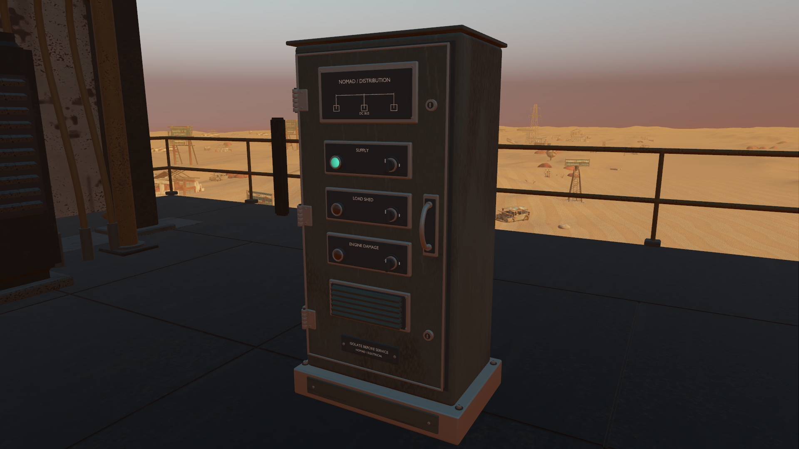
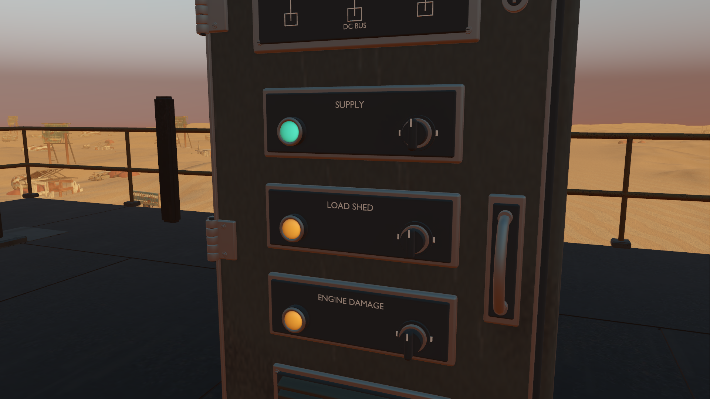
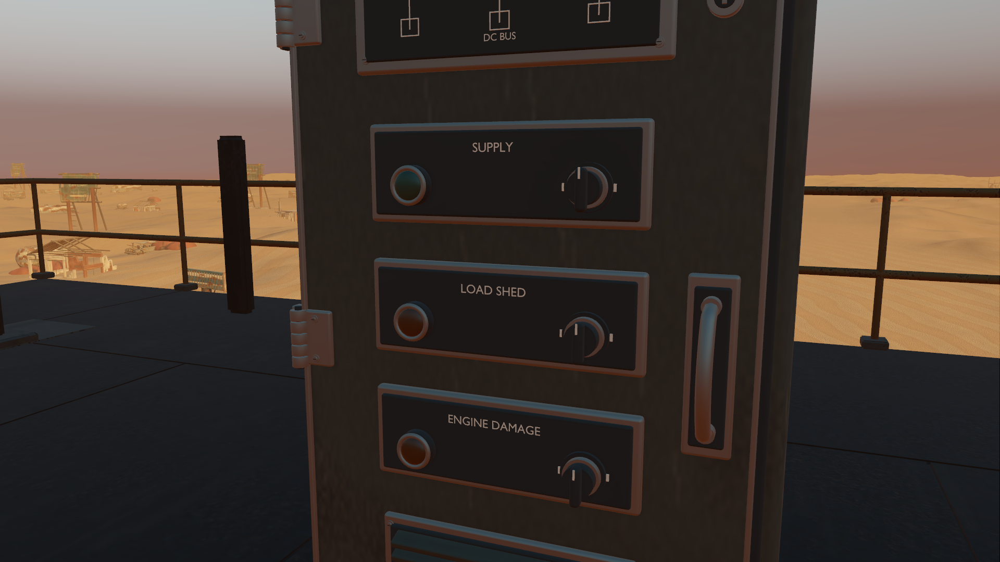

# Detailed electrical cabinets with live machine indicators

Starting revision: `2a0fa07` on `codex/godot-native-port`. The preceding iteration refined the pressure vessels. This pass improves the four adjacent electrical cabinets and makes their small lamps reflect the existing simulation. No story, progression, power/repair rules or interaction flow was added.

## Art and integration

The original cabinets had plain slab doors, faceted controls, no readable legends and continuously lit lamps. The new original Blender master has formed enclosure/door edges, a sealing gasket, actual hinges, locks, a folded handle, labelled control assemblies, a recessed circuit diagram, louvered vent, grounded plinth and sealed cable fittings. Controls face the existing aisles at all four original sites.

Native and studio review corrected coincident roof faces, rear gland alignment and eight long bevel slivers that collapsed under native vertex compression. The final source has 207 editable parts and becomes five shared material batches, 54,220 triangles per full-resolution instance. Godot retains its standard generated LODs and mesh compression. No new physics bodies or lights are required.

The replacement trims six shared frozen batches. Two already contain the previous vessel refinement; their final remainders are rebuilt directly from the original bake with both removals applied. This prevents restored obsolete fittings and avoids another geometry quantization round. Stable node names and original materials are retained. The earlier vessel-preservation test now checks the exact combined remainder, retaining its 1 mm tolerance.

## Existing state made visible

The green SUPPLY lamp follows existing generation capacity. Amber LOAD SHED follows existing excess demand, and ENGINE DAMAGE follows existing engine health. All lamps go dark when the cabinet has no supply. Four cabinets share one opaque shader; lens geometry contains three one-hot COLOR_0 channels. Emission falls toward the molded lens rim so the indicators retain their rounded shape instead of clipping into flat bright disks.

Sampling occurs every 250 ms of simulation time and writes one shared uniform only when state changes. Menus pause it with gameplay. It is a read-only presentation of established rules; controls continue through the current menu/interaction flow. Exact thresholds and source references are documented in the [asset README](../../assets/native-switchgear/README.md).

## Verification

The native switchgear suite verifies retained geometry and material identity, all original placements/aisle orientations, grounded bounds, the original complete footprint, valid imported triangles and the actual vertex-color channels. Real player movement and raycasts confirm that the four existing collision shells remain solid and approachable.

It exercises actual session power calculation, overload shedding, fuel exhaustion, refuelling and engine repair. It verifies paused/resumed updates, the sampling interval, rigid attachment through gait and unchanged session snapshots around every status refresh. The Blender geometry check verifies plinth/body/lid contact and all 36 cabinet-to-cargo/vessel mesh pairs; none intersect.

Both exported GLBs pass Khronos validation with zero errors and warnings. Informational messages concern unused UV/tangent attributes on flat materials and empty named anchors. Native selected test/render logs are checked separately for script errors or warnings.

All **613 selected assertions pass**: switchgear 76, pressure vessels 77, cargo cases 56, machine access 13, traversal 13, integration 108, audit parity 132, play parity 58, canopy 26 and camera clearance 54. The [suite report](results/switchgear-regressions.json) and [switchgear results](results/switchgear-tests.json) retain the counts and measured geometry/state checks. Selected native test/render logs have no errors or warnings. These are evidence for this change, not a claim that the full campaign or broader performance investigation is complete.

## Rendering cost

The [comparison report](results/switchgear-profile.json) uses an RTX 3070 at 1920 × 1080, high Forward+/Vulkan, 4× MSAA, VSync off and an uncapped loop. Both art resources are resident in both runs. The preceding pressure-vessel refinement remains present when restoring legacy cabinet geometry. Each view warms up for two seconds and measures four seconds before screenshot readback; runs are sequential without concurrent Blender renders.

| View | Before GPU median | After GPU median | Difference | Draw calls, before → after |
|---|---:|---:|---:|---:|
| Fore cabinet | 2.624 ms | 2.746 ms | +0.122 ms | 540 → 560 |
| Controls close-up | 2.384 ms | 2.538 ms | +0.154 ms | 353 → 361 |
| Starboard cabinet | 2.165 ms | 2.237 ms | +0.072 ms | 178 → 182 |
| Workshop overview | 3.229 ms | 3.296 ms | +0.067 ms | 1170 → 1221 |

This is a fixed-view cost comparison with gameplay frozen, not a claim of improved gameplay FPS. The cabinet update uses cached four-Hz presentation sampling and shares its resources. The broad goal remains active, including other existing workshop equipment and independently observed intermittent frame stalls.
