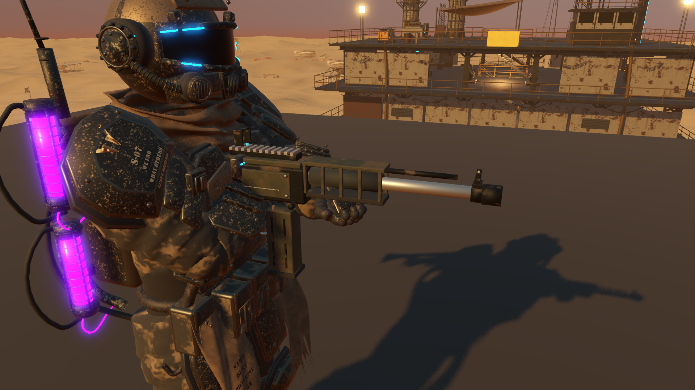

# Native weapon refinement and grip coherence

Continues the [enhancement goal](enhancement-goal.md) from `265f4c5`. Character close-ups exposed a plain held rifle, an unsupported left fist and a tracer origin roughly half a metre behind the visible muzzle. This pass refines both existing guns in Blender and makes their authored anchors drive native hand/effect placement.

## Model and pose changes

The [editable source kit](../../assets/native-weapons/README.md) contains detailed receivers, open vent bays and bores, connected front sights, rubber grips, magazines/pump parts, stencils, sling fittings and original packed PBR maps. Source and native views were checked repeatedly; the first support marker sat too low, and the rifle's sight ears needed a physical collar. Both were corrected before the final export. The source was appended and inspected through Blender MCP without replacing the existing live scenes.

The right hand carries the gun through the original authored socket. A two-arm presentation solver keeps the support wrist at the gun's `SupportGrip` anchor, matches pitch and moves both hands with visual recoil. The shared hold is constrained by actual arm lengths. Reload blends release to the original authored upper-body clip, while terminal, refuelling, scripted movement, turret, cinematic and death states retain their own presentation. Capsule movement, camera hitscan, damage, spread/random sequence, ammunition, fire rate and reload duration remain unchanged.

Muzzle attachments now mount on the actual barrel, and the burst selector faces outboard from the receiver. Their scale remains one metre per authored unit. Tracers emerge from the active weapon's muzzle or fitted device outlet. Switching guns refreshes hardware immediately, preventing a same-frame shot from using the previous gun's device. Camera fading covers the new meshes and accessories.

[Original rifle](previews/weapon-before-rifle.png), [shotgun grip](previews/weapon-shotgun-hands.png), [upward aim](previews/weapon-up.png), [downward aim](previews/weapon-down.png), [fitted shotgun device](previews/weapon-device.png) and [Blender MCP review](previews/weapon-mcp.png) retain the visual comparison. The flat support platform belongs only to the diagnostic, inside the real native world/lighting.

## Contact and behavior verification

The focused suite observes the final skeleton through `SkeletonModifier3D.modification_processed`. Godot's ordinary bone-pose reads outside that callback expose the pre-modifier animation, so they cannot validate the rendered hand position. See the [official modifier documentation](https://docs.godotengine.org/en/stable/classes/class_skeletonmodifier3d.html).

68 checks cover both guns at five pitches from −70° to +75°, reachable arm chains, support contact, the intentional 5.48 cm wrist-to-palm socket offset, bore direction, shared recoil, actual tracer endpoints, unchanged deterministic pellet sequences, shot cadence/ammunition, reload release/recovery, all four attachments and fading, immediate switching, six presentation interruptions and eight real movement combinations. Support-anchor error is below 0.000003 m in the static sample. This verifies the wrist constraints; the glove's finger geometry was also checked visually, rather than claiming the numerical result measures finger contact.

The [focused report](results/weapon-tests.json) contains the exact pose measurements. Integration (108), navigation/parity audit (132), locomotion (39), native camera (54) and native physical-input gameplay parity (57) also pass: **458 assertions** across these suites, with no engine errors/warnings in their logs. The [regression summary](results/weapon-regressions.json) records each count. The character and original browser weapon sources remain intact; no story content or combat balance changes were added.

## Rendering cost

RTX 3070, 1920×1080, Vulkan Forward+, high quality, 4× MSAA, VSync off. The same native world, idle character and fixed close view alternates original/refined mesh-and-pose presentation, with both asset sets resident. Each sample warms for 2 seconds then measures 5 seconds. This is a controlled presentation comparison, not combat or streaming FPS.

| View | Original median frame / GPU | Refined median frame / GPU |
| --- | ---: | ---: |
| Rifle pair 1 | 2.566 / 2.089 ms | 2.568 / 2.091 ms |
| Rifle pair 2 | 2.579 / 2.099 ms | 2.572 / 2.097 ms |
| Shotgun pair 1 | 2.580 / 2.100 ms | 2.560 / 2.088 ms |
| Shotgun pair 2 | 2.573 / 2.104 ms | 2.553 / 2.091 ms |

The actual final-pose callback costs 0.033 ms median and 0.046 ms p95 in all four refined samples. Scene draw calls increase from 306 to 315 for the rifle and 313 for the shotgun; the measured GPU difference is negligible in this view. [Full results](results/weapon-profile.json) retain percentiles, maxima and sample counts. This is a visual improvement with a small CPU cost, not an FPS optimization or a resolution of the separate intermittent frame-stall investigation.

Run `tools/godot/launch.ps1 -WeaponTest -Headless`, `-WeaponReview`, or `-WeaponProfile` to reproduce the focused checks, native views or rendering comparison. Each uses isolated test saves/settings. The broader goal remains active, including full-game feel, visual cohesion and the unresolved intermittent stalls.
