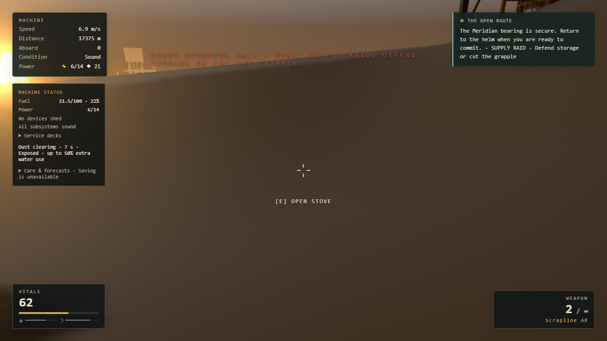
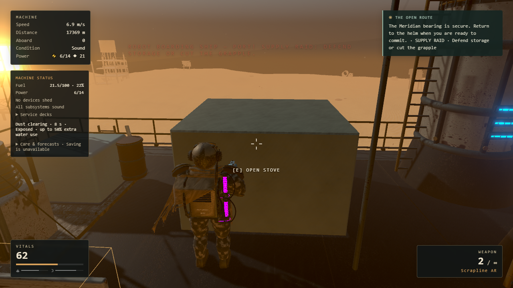
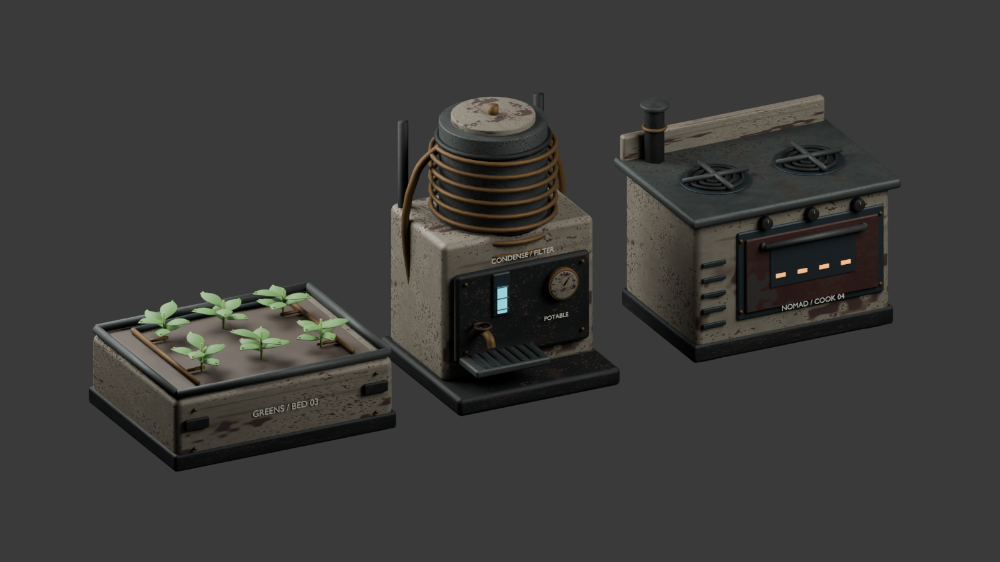

# Interior visibility and galley refinement

This pass fixes the opaque canvas that could cover the camera near the galley, gives boarding warnings a reliable end, and replaces the stove, condenser and planter with original Blender models. Combat, movement, collision, recipes, production, power and save schemas retain their existing rules.

## Camera diagnosis and correction

The brown foreground was `Tailored_hanging_banner001_2`, the `Nomad_cloth` batch inside the authored machine's `Canvas_and_Rigging`. At the reproduced angle its center-ray hit was 1.44 m from the camera, even though the player was 3.84 m away and the camera boom was almost fully extended. The cloth is decorative and deliberately absent from the hull's collision export. A separate level view correctly shortened the camera against the solid engine.

| Before                                        | After                                                               |
| --------------------------------------------- | ------------------------------------------------------------------- |
|  |  |

Only that explicitly selected cloth batch fades when it lies between the camera and the player's chest. It uses owned material clones, restores the original materials when clear, and retains the fade behind pause/inventory screens. Camera transitions, turret use, death, load, new game and disposal restore the original assignment. Mouse look, shoulder offsets, aim and physics remain unchanged.

The diagnostic runner exercised a 24-angle orbit, both shoulders with hip and aimed views at the galley and middle stair mouth, and normal descent/ascent between the upper and middle decks. All eight shoulder/aim captures were visually reviewed. Eleven focused material/lifecycle tests include 100 blocking/clear cycles reusing the same clone.

## Encounter warning lifecycle

Boarding notices now hold a token which only their own terminal cleanup can clear. A newer ordinary notice or death message invalidates that token. Delayed hook announcements also respect the dead-player state. Scripted patrol text uses the active chapter title while retaining the existing encounter ID for compatibility.

Focused Game/HUD tests cover terminal boarding, unchanged rewards/events, stale cleanup, replacement, reset and the delayed death callback. The cold Continue run starts with no stale boarding warning. This pass does not claim a new end-to-end combat playthrough for every outcome.

## Blender galley kit

| Model     | Triangles | Footprint (m) | Detail                                                               |
| --------- | --------: | ------------- | -------------------------------------------------------------------- |
| Stove     |    12,848 | 1.55 × 1.223  | Worn enamel, cast-iron burners, recessed oven, controls, flue        |
| Condenser |    14,152 | 1.216 × 1.205 | Pressure vessel, copper coil, gauge, water level, tap and drain tray |
| Planter   |    11,740 | 1.64 × 1.303  | Rolled tray, soil, six plants and irrigation lines                   |

The kit has 25 meshes, 38,740 triangles and a 4,685,152-byte runtime GLB. It shares the existing Array material palette, adds no scene lights and fits the original 2 m cells. Runtime colliders and build definitions are unchanged. Adjacent wide planters leave only 0.34 m between them; this is not a player aisle.

The normal-input galley run collected water and greens, spent exactly one of each to cook a ration, ate that ration and left the service aisle. A separate normal Save & Quit followed by a fresh browser Continue restored all 13 structures exactly, including producer progress and stored output, all 20 inventory slots, and all three authored model roots.

The editable source, export tools, model report and glTF validator are [documented with the assets](../../assets/galley/README.md). Blender MCP review used the running Blender instance. No external assets were needed; no Unreal import is claimed.

## Validation and limits

- Full local unit run: 1,537 tests across 176 files passed; the subsequently added 100-cycle test passed with the other ten cloth tests. CI runs the resulting 1,538-test suite.
- ESLint, TypeScript and production build passed. glTF validation: zero errors and zero warnings; independent exported bounds match Blender within 2 mm.
- Medium and High: 180 frame intervals each for still, rotating and post-rotation stages in headless Chromium/D3D11 at 1280×720. Medians were about 16.7 ms and p99 about 16.8 ms. Each run had one interval over 50 ms in the last stage as an ordinary skiff appeared.
- High held 181 renderer programs throughout; the clear-view stage restored cloth opacity from 0.06 to 1 and the original material identity. The Medium archived reference is PR21, not an exact main-commit A/B; both it and current Medium gained the same 28 geometries and 23 textures during encounter preparation.

These frame samples are capped by 60 Hz presentation and do not establish GPU headroom or guarantee 60 FPS on every PC. The full initial proposal's all-station/all-deck/fallback manual matrix and manual relocation/demolition were not repeated. Existing camera/build/save tests cover those unchanged mechanisms; this release's normal-input coverage is the specific route described above.

[Measured evidence and source hashes](validation.json) · [Task plan](../superpowers/plans/2026-09-15-interior-galley-polish.md) · [Normal cooking](galley-cooking.png) · [Cold Continue](cold-continue.png) · [Stair aiming](stairs-aim.png)

Run `tools/campaign/inspect-interior-camera.mjs` against a local production preview and a cloned campaign profile. `MMF_CONTINUITY_PROFILE` selects the profile; `MMF_SITE` selects the URL. Modes are `MMF_CAMERA_SWEEP=2`, `MMF_CAMERA_MATRIX=1`, `MMF_CAMERA_BENCH=1`, `MMF_GALLEY_REVIEW=1`, or `MMF_GALLEY_COLD_ONLY=1`. Use one mode at a time. The combined `MMF_GALLEY_COLD=1` option requires reaching a safe save boundary after cooking; an active encounter deliberately prevents that save.
