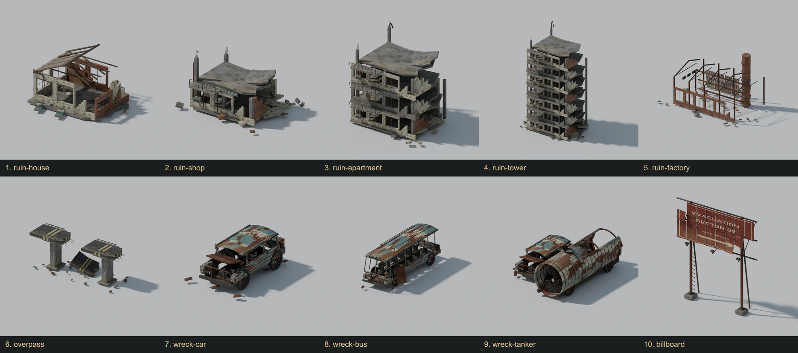
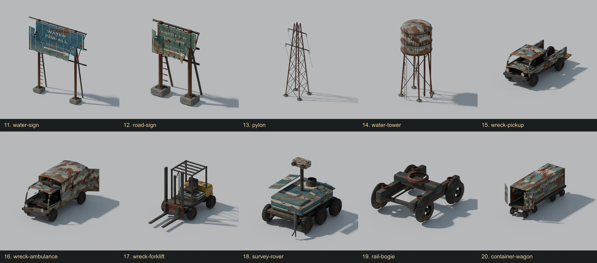
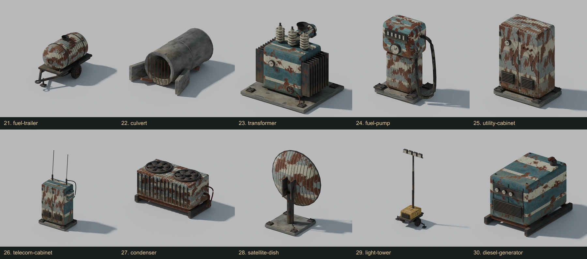
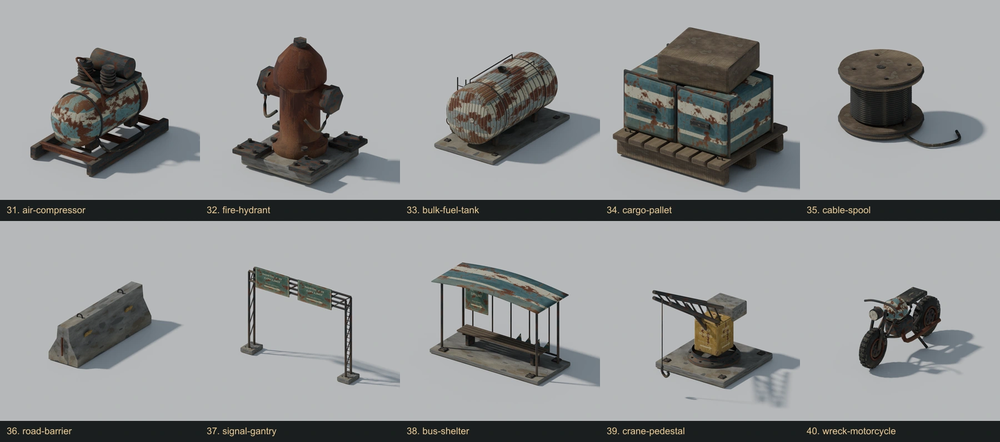
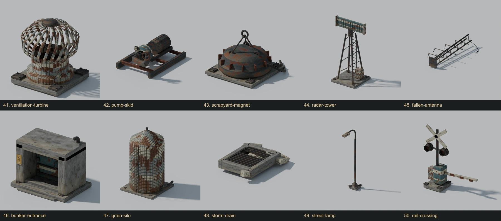

# Machine Move Forward - 50 model gallery

The latest Blender art pass: 14 refined models and 36 new models. Scroll through the five labeled sheets below. Tap a model name to view its full-size render.

## Models 1-10

[Open this sheet at full size](catalog-1.webp?raw=true)

- **1. [ruin house](renders/01-ruin-house.png?raw=true)** - Hollow roof and window bays refined with curved broken gutter, hinge fittings, exposed split bricks and smoother edge bevels.
- **2. [ruin shop](renders/02-ruin-shop.png?raw=true)** - Ruined storefront with half-dropped shutter, guide channels, fascia, balcony balusters and exposed structural layers.
- **3. [ruin apartment](renders/03-ruin-apartment.png?raw=true)** - Four-storey collapsed apartments with narrow balcony balusters, connected service riser and pipe clamps.
- **4. [ruin tower](renders/04-ruin-tower.png?raw=true)** - Eight-storey concrete skeleton with broken masonry, reinforced balconies, continuous riser and smoother slab/column edges.
- **5. [ruin factory](renders/05-ruin-factory.png?raw=true)** - Open industrial hall with footed columns, anchor bolts, continuous steam return, valve and ventilation louvres.
- **6. [overpass](renders/06-overpass.png?raw=true)** - Broken road sections with load-bearing pier footings, concrete parapet curbs and dangling reinforcement.
- **7. [wreck car](renders/07-wreck-car.png?raw=true)** - Hollow rusted car with smoother body edges, curved exhaust, full axles, leaf springs and bent mirror arms.
- **8. [wreck bus](renders/08-wreck-bus.png?raw=true)** - Hollow bus with seats, detailed undercarriage, mirrors, exhaust and interior overhead grab rails.
- **9. [wreck tanker](renders/09-wreck-tanker.png?raw=true)** - Ruptured tanker shell with open bore, ribs, service valve, analog gauge and manway.
- **10. [billboard](renders/10-billboard.png?raw=true)** - Torn continuous-UV advertising sheets with bolted anchor flanges, face fixings and supported floodlights.

## Models 11-20

[Open this sheet at full size](catalog-2.webp?raw=true)

- **11. [water sign](renders/11-water-sign.png?raw=true)** - Weathered civil-reserve sign with real torn sheets, anchor flanges, bolts and mounting hardware.
- **12. [road sign](renders/12-road-sign.png?raw=true)** - Damaged wayfinding panel with reinforced footing mounts, fasteners and smooth round support pipes.
- **13. [pylon](renders/13-pylon.png?raw=true)** - Lattice power pylon with concrete foundations, steel anchoring plates, aligned splice plates and porcelain insulators.
- **14. [water tower](renders/14-water-tower.png?raw=true)** - Elevated water tank with smooth dished roof, exterior ladder, properly attached stand-offs, footings and overflow pipe.
- **15. [wreck pickup](renders/15-wreck-pickup.png?raw=true)** - Open cargo bed, dropped tailgate, curved cab, seats, dashboard, lugs, leaf springs and exhaust.
- **16. [wreck ambulance](renders/16-wreck-ambulance.png?raw=true)** - Hollow medical van, open rear doors, stretcher, raised medical emblems and rounded emergency beacons.
- **17. [wreck forklift](renders/17-wreck-forklift.png?raw=true)** - Counterweight, guarded operator station, twin-channel lifting mast, hydraulic ram, hoses and grounded forks.
- **18. [survey rover](renders/18-survey-rover.png?raw=true)** - Six wheel survey platform, paired optics, lidar, solar wings, sampling arm and suspension.
- **19. [rail bogie](renders/19-rail-bogie.png?raw=true)** - Flanged steel wheels, leaf/cast frame, coil springs, brake rods and wagon swivel.
- **20. [container wagon](renders/20-container-wagon.png?raw=true)** - Two bogies, corrugated open freight container, locking bars, cast corners and knuckle couplers.

## Models 21-30

[Open this sheet at full size](catalog-3.webp?raw=true)

- **21. [fuel trailer](renders/21-fuel-trailer.png?raw=true)** - Dished strapped tank, tow eye, jack, metering gauge, dispensing hose and chassis.
- **22. [culvert](renders/22-culvert.png?raw=true)** - Thick open concrete bore, expansion collars, wing walls, broken inlet grate and rubble.
- **23. [transformer](renders/23-transformer.png?raw=true)** - Oil housing, radiator fins, porcelain bushings, conservator, valves and earth braid.
- **24. [fuel pump](renders/24-fuel-pump.png?raw=true)** - Rounded enamel pump, mechanical counter, analog gauge, hanging hose and metal nozzle.
- **25. [utility cabinet](renders/25-utility-cabinet.png?raw=true)** - Double service doors, hinges, recessed handles, switchgear, vent louvres and buried conduits.
- **26. [telecom cabinet](renders/26-telecom-cabinet.png?raw=true)** - Vented telecom doors, radio receiver, roof aerials, coax and service footings.
- **27. [condenser](renders/27-condenser.png?raw=true)** - Twin curved fan impellers, protective grilles, exchanger fins, skid and refrigerant lines.
- **28. [satellite dish](renders/28-satellite-dish.png?raw=true)** - Concave rolled paraboloid, focal receiver, three support struts, yoke and coax.
- **29. [light tower](renders/29-light-tower.png?raw=true)** - Towed generator, telescopic mast, four floodlights, stabilizer jacks and cable.
- **30. [diesel generator](renders/30-diesel-generator.png?raw=true)** - Bevelled enclosure, service panels, gauges, cooling louvres, muffler and bolted skid.

## Models 31-40

[Open this sheet at full size](catalog-4.webp?raw=true)

- **31. [air compressor](renders/31-air-compressor.png?raw=true)** - Dished receiver tank, motor, finned twin cylinders, copper lines, regulator and hose.
- **32. [fire hydrant](renders/32-fire-hydrant.png?raw=true)** - Smooth cast barrel, domed crown, hex caps, retaining chains and anchor flange.
- **33. [bulk fuel tank](renders/33-bulk-fuel-tank.png?raw=true)** - Large dished vessel, straps, saddles, ladder, delivery riser, gauge and rail.
- **34. [cargo pallet](renders/34-cargo-pallet.png?raw=true)** - Runner-supported wood pallet, individual boards, banded cases, lifting pockets and top crate.
- **35. [cable spool](renders/35-cable-spool.png?raw=true)** - Wood flanges, steel rims, nineteen cable turns, fasteners and loose grounded tail.
- **36. [road barrier](renders/36-road-barrier.png?raw=true)** - Concrete Jersey profile, lifting eyes, reflectors and exposed coupling pins.
- **37. [signal gantry](renders/37-signal-gantry.png?raw=true)** - Footed lattice gantry, twin direction panels, mounting tubes and maintenance ladder.
- **38. [bus shelter](renders/38-bus-shelter.png?raw=true)** - Curved roof, tubular frame, slatted bench, faded route map and jagged retained glazing.
- **39. [crane pedestal](renders/39-crane-pedestal.png?raw=true)** - Bolted slew bearing, lattice boom, ram, counterweight, hanging cable and forged hook.
- **40. [wreck motorcycle](renders/40-wreck-motorcycle.png?raw=true)** - Tubular frame, smooth tank, finned engine, forks, headlight, bent bars, exhaust and kickstand.

## Models 41-50

[Open this sheet at full size](catalog-5.webp?raw=true)

- **41. [ventilation turbine](renders/41-ventilation-turbine.png?raw=true)** - Twenty-four rolled curved vanes, hollow ventilator, hub cap and roof curb.
- **42. [pump skid](renders/42-pump-skid.png?raw=true)** - Finned motor, centrifugal volute, elbowed suction pipe, flanges, valve and gauge.
- **43. [scrapyard magnet](renders/43-scrapyard-magnet.png?raw=true)** - Profiled steel electromagnet, radial cooling ribs, lifting lugs, chain sling and power lead.
- **44. [radar tower](renders/44-radar-tower.png?raw=true)** - Braced lattice mast, azimuth bearing, slotted waveguide array, access ladder and control box.
- **45. [fallen antenna](renders/45-fallen-antenna.png?raw=true)** - Collapsed lattice mast, bent Yagi elements, torn mounting flange and trailing coax.
- **46. [bunker entrance](renders/46-bunker-entrance.png?raw=true)** - Thick concrete portal, stiffened vault door, hinges, locking wheel, steps and vent.
- **47. [grain silo](renders/47-grain-silo.png?raw=true)** - Smooth conical cap, rolled shell corrugations, safety ladder, grain auger and roof breather.
- **48. [storm drain](renders/48-storm-drain.png?raw=true)** - Concrete kerb, open metal grate with missing and bent bars, recessed well and broken rubble.
- **49. [street lamp](renders/49-street-lamp.png?raw=true)** - Tapered standard, curved swan neck, rounded luminaire, diffuser, service hatch and anchors.
- **50. [rail crossing](renders/50-rail-crossing.png?raw=true)** - Crossbuck, hooded dual signal lamps, broken striped gate, actuator and junction box.
